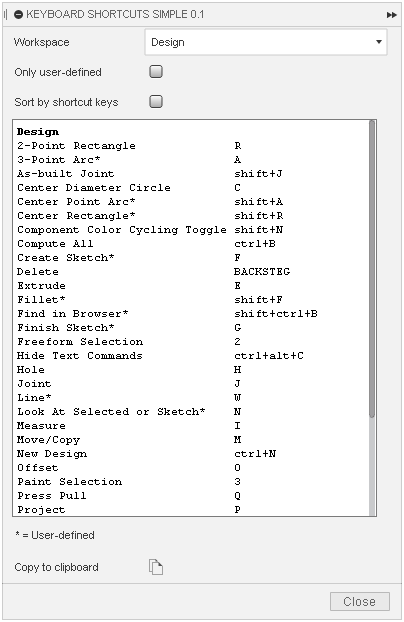

# KeyboardShortcutsSimple

A Fusion 360 script for showing all assigned keyboard shortcuts. Use it to share setups and to find free keys (sort by shortcut keys).

## Installation
Download the latest release from the [Releases](https://github.com/thomasa88/KeyboardShortcutsSimple/releases) page.

Unpack it into `API\Scripts` (see [How to install an add-in or script in Fusion 360](https://knowledge.autodesk.com/support/fusion-360/troubleshooting/caas/sfdcarticles/sfdcarticles/How-to-install-an-ADD-IN-and-Script-in-Fusion-360.html)).

Make sure the directory is named `KeyboardShortcutsSimple`, with no suffix.

## Usage

Press Shift+S in Fusion 360 and go to the *Scripts* tab. Then double-click *KeyboardShortcutsSimple*.

## "I cannot add a shortcut for *XYZ*"

Have a look at [AnyShortcut](https://github.com/thomasa88/AnyShortcut/blob/master/README.md).